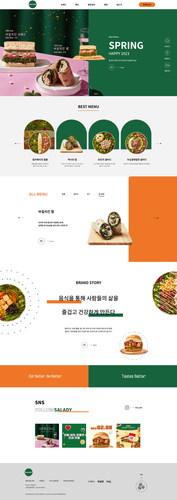
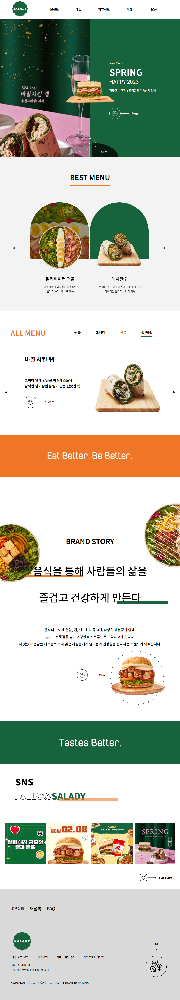
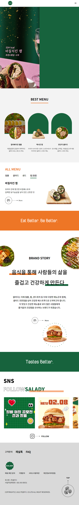

# Responsiv_Wep : Sabon
- pc / tablet / mobile 반응형 웹 구현
- react slick 사용
- swiper 사용
  
---
### 1. 결과물


---


### 2.1 react slick
- contents 순번매기기
  ```java
      const [num , setNum] = useState(1);
        const settings = {
        beforeChange: (current, next) => setNum(next+1),
      };
  ```
- 반응형 화면 구현
  ```java
      const settings = {
        slidesToShow: 4,
        responsive: [ // 반응형 웹 구현 옵션
            {  
                breakpoint: 1023,
                settings: {
                    slidesToShow:2 
                } 
            },
            { 
                breakpoint: 767,
                settings: {	
                    slidesToShow:3
                } 
            }
        ]
      };
    ```

### 2.2 swiper 
- 반응형 화면 구현
  ```java
    slidesPerView={4}
    breakpoints={{
        0: {
            slidesPerView: 2.2, // 2.5개로 변경
        },
        768: {
            slidesPerView: 4, // 4개로 변경
        }
    }}

    // 자동재생 구현 옵션
    autoplay={{ delay: 2000, disableOnInteraction: false }}
    loop={true}
  ```

### 3.1 pc - 해상도 1024px 이상
- css : 단위 px 사용



---
### 4.2 tablet - 해상도 768px ~ 1023px
- css : 단위 vw 사용


---

### 4.3 mobile - 해상도 767px 이하
- css : 단위 vw 사용




